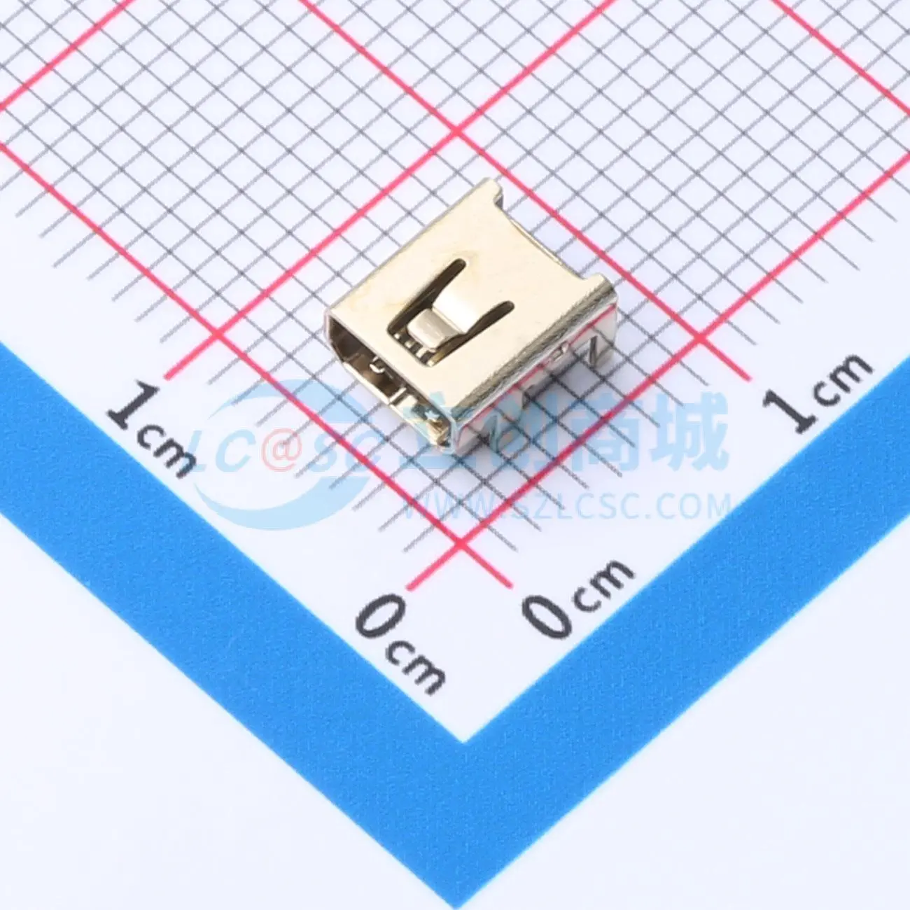

[Mini USB 8P PORT（JLC LCSC link](https://item.szlcsc.com/7279358.html)

# Mini USB 8P 接口线序测定报告

&gt; 测定方法：拆装验证法（控制变量法）  
&gt; 适用对象：Mini USB 8P 母座（JLC 料号关键词：Mini8P）

---

## 1. 测定背景

Mini USB 接口虽已逐步淘汰，但在复古电子设备仍有应用需求。  
JLC 等平台的 **Mini8P** 封装与常见线材的对应关系缺乏公开文档，故进行本测定。

---

## 2. 测定方法

采用 **拆装验证法**：

1. 拆解 Mini USB 插头，暴露焊点
2. 记录焊点与线材的对应关系
3. 重新组装，连接 MP3 播放器与电脑验证功能正常
4. 重复拆装 2 次，确保结果可复现

**验证标准**：拆装后设备仍能被电脑正常识别并通信。

---

## 3. 线序定义（Mini USB 8P 母座视角）

正对接口焊接脚，焊盘从左到右编号 1-8：

| 脚位 | 功能 | 常见线色 | 备注 |
|:---:|:---|:---|:---|
| **1** | **GND** | 黑 | 电源负极 |
| 2 | 空 | - | 悬空 |
| 3 | 空 | - | 悬空 |
| 4 | 空 | - | 悬空 |
| **5** | **D+** | 绿 | USB 差分信号+ |
| 6 | 空 | - | 悬空 |
| **7** | **D-** | 白 | USB 差分信号- |
| **8** | **VCC** | 红 | 电源正极 +5V |

# Mini USB 8P Pinout Determination Report

> **Methodology:** Disassembly & Verification (Controlled Variable Method)  
> **Target Object:** Mini USB 8P Female Socket (JLC Part Number Keyword: Mini8P)

---

## 1. Background

Although Mini USB interfaces are gradually being phased out, they are still used in retro electronic devices.  
As public documentation regarding the mapping between **Mini8P** footprints on platforms like JLC and common cable wiring is scarce, this determination was conducted.

---

## 2. Methodology

The **Disassembly & Verification** method was used:

1. Disassemble the Mini USB plug to expose the solder joints.
2. Record the relationship between solder joints and wire colors.
3. Reassemble and connect an MP3 player to a computer to verify normal functionality.
4. Repeat the disassembly and assembly process twice to ensure results are reproducible.

**Verification Standard**: The device must be correctly recognized by and communicate with the computer after reassembly.

---

## 3. Pinout Definition (View from Mini USB 8P Female Socket)

Facing the soldering pins of the interface, the pads are numbered 1-8 from left to right:

| Pin | Function | Common Wire Color | Remarks |
|:---:|:---|:---|:---|
| **1** | **GND** | Black | Power Negative |
| 2 | NC | - | Not Connected |
| 3 | NC | - | Not Connected |
| 4 | NC | - | Not Connected |
| **5** | **D+** | Green | USB Differential Signal + |
| 6 | NC | - | Not Connected |
| **7** | **D-** | White | USB Differential Signal - |
| **8** | **VCC** | Red | Power Positive +5V |
